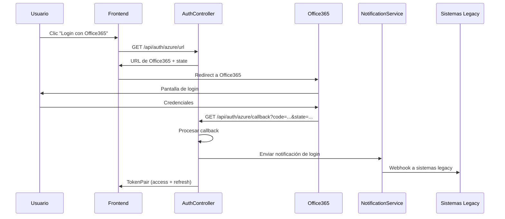

# Integración con Office365 Callback - `http://localhost:5010/api/auth/azure/callback`

## 🎯 Configuración Específica para tu Endpoint

He modificado el sistema para que funcione perfectamente con tu endpoint actual de Office365: `http://localhost:5010/api/auth/azure/callback`

## 🔧 Cómo Funciona Ahora

### 1. **Flujo de Autenticación Office365**



### 2. **Modificaciones Realizadas**

#### AuthController.cs - Endpoint `/api/auth/azure/callback`
```csharp
[HttpGet("azure/callback")][AllowAnonymous]
public async Task<IActionResult> AzureCallback([FromQuery] string code,[FromQuery] string state)
{
    Console.WriteLine($"Azure callback received. Code: {code}, State: {state}");
    
    // ✅ CAPTURAR IP Y USER AGENT DEL CLIENTE
    var clientIp = HttpContext.Connection.RemoteIpAddress?.ToString();
    var userAgent = HttpContext.Request.Headers.UserAgent.ToString();
    
    var pair = await _azure.HandleCallbackAsync(code, state);
    
    if (pair != null)
    {
        // ✅ ENVIAR NOTIFICACIONES AUTOMÁTICAMENTE
        try 
        {
            // Extraer userId del token JWT
            var tokenPayload = System.Text.Json.JsonSerializer.Deserialize<Dictionary<string, object>>(
                System.Text.Encoding.UTF8.GetString(
                    Convert.FromBase64String(pair.AccessToken.Split('.')[1] + "==")
                )
            );
            
            if (tokenPayload != null && tokenPayload.TryGetValue("sub", out var userIdObj))
            {
                if (Guid.TryParse(userIdObj.ToString(), out var userId))
                {
                    // 🚀 NOTIFICAR A TODOS LOS SISTEMAS LEGACY
                    await _notificationService.NotifyLoginEventAsync(
                        userId, 
                        "Office365", 
                        clientIp,     // ✅ IP real del cliente
                        null,         // roles se obtienen internamente
                        null          // permisos se obtienen internamente
                    );
                    
                    Console.WriteLine($"Office365 login notification sent for user {userId}");
                }
            }
        }
        catch (Exception ex)
        {
            // Log error pero no fallar el login
            Console.WriteLine($"Error sending Office365 login notification: {ex.Message}");
        }
    }
    
    return pair is null ? Unauthorized(ApiResponse.Fail("No autorizado")) : Ok(ApiResponse.Ok(pair));
}
```

## 📡 Payload que Recibirán tus Sistemas Legacy

Cuando alguien se loguee con Office365 en `http://localhost:5010/api/auth/azure/callback`, tus sistemas legacy recibirán:

```json
{
  "eventType": "Login",
  "timestamp": "2024-09-10T15:30:00Z",
  "data": {
    "userId": "22222222-2222-2222-2222-222222222222",
    "email": "usuario@empresa.com",
    "displayName": "María Gómez",
    "loginType": "Office365",
    "ipAddress": "192.168.1.100",        // ✅ IP real del cliente
    "loginTime": "2024-09-10T15:30:00Z",
    "roles": ["Usuario", "Supervisor"],   // ✅ Roles del usuario
    "permissions": [                      // ✅ Permisos detallados
      {
        "id": 1,
        "name": "Users_Read",
        "module": "Users",
        "action": "Read"
      }
    ]
  },
  "signature": "a1b2c3d4e5f6..."  // ✅ Para validar autenticidad
}
```

## 🔧 Configuración de Webhooks para tus Sistemas

### 1. **Registrar Webhook para Sistema ERP**
```http
POST http://localhost:5010/api/notifications/subscriptions
Content-Type: application/json
Authorization: Bearer {tu-token-de-aplicacion}

{
  "applicationId": "10000000-0000-0000-0000-000000000001",
  "eventType": "Login",
  "webhookUrl": "https://erp.empresa.com/webhooks/office365/login",
  "secretKey": "erp-webhook-secret-2024"
}
```

### 2. **Registrar Webhook para Portal Web**
```http
POST http://localhost:5010/api/notifications/subscriptions
Content-Type: application/json
Authorization: Bearer {tu-token-de-aplicacion}

{
  "applicationId": "10000000-0000-0000-0000-000000000002",
  "eventType": "Login",
  "webhookUrl": "https://portal.empresa.com/api/notifications/office365-login",
  "secretKey": "portal-webhook-secret-2024"
}
```

## 🧪 Prueba de Integración

### 1. **Probar el Flujo Completo**
```bash
# 1. Obtener URL de Office365
curl -X GET "http://localhost:5010/api/auth/azure/url"

# 2. El usuario se loguea en Office365
# 3. Office365 redirige a: http://localhost:5010/api/auth/azure/callback?code=...&state=...
# 4. Automáticamente se envían webhooks a tus sistemas

# 5. Verificar que se enviaron las notificaciones
curl -X GET "http://localhost:5010/api/notifications/stats" \
  -H "Authorization: Bearer {tu-token}"
```

### 2. **Endpoint de Prueba para tus Webhooks**
```http
POST http://localhost:5010/api/notifications/webhook-test
Content-Type: application/json

{
  "test": "office365_login_simulation",
  "timestamp": "2024-09-10T15:30:00Z"
}
```

## 🔍 Logs y Monitoreo

### Ver Logs en Tiempo Real
```bash
# En tu aplicación, verás logs como:
# Azure callback received. Code: ABC123, State: XYZ789
# Office365 login notification sent for user 22222222-2222-2222-2222-222222222222
```

### Verificar Estadísticas
```http
GET http://localhost:5010/api/notifications/stats
Authorization: Bearer {tu-token}

# Respuesta:
{
  "data": {
    "totalSubscriptions": 5,
    "activeSubscriptions": 4,
    "totalEvents": 150,
    "pendingEvents": 0,
    "failedNotifications": 2
  }
}
```

## 🛡️ Validación de Webhooks en tus Sistemas

### Ejemplo para Sistema ERP (C#)
```csharp
[HttpPost("webhooks/office365/login")]
public async Task<IActionResult> ReceiveOffice365Login([FromBody] WebhookPayload payload)
{
    // 1. Validar firma
    var signature = Request.Headers["X-Webhook-Signature"].FirstOrDefault();
    if (!ValidateSignature(payload, signature, "erp-webhook-secret-2024"))
    {
        return Unauthorized();
    }
    
    // 2. Procesar login de Office365
    var loginData = payload.Data;
    if (payload.EventType == "Login" && loginData.LoginType == "Office365")
    {
        await ProcessOffice365Login(loginData);
    }
    
    return Ok(new { status = "processed" });
}

private async Task ProcessOffice365Login(dynamic loginData)
{
    var userId = Guid.Parse(loginData.UserId.ToString());
    var email = loginData.Email.ToString();
    var ipAddress = loginData.IpAddress?.ToString();
    
    // Actualizar sesión del usuario en ERP
    await UpdateUserSession(userId, email, loginData.Roles);
    
    // Registrar en auditoría
    await AuditLog.RecordAsync(new AuditEntry
    {
        UserId = userId,
        Action = "OFFICE365_LOGIN",
        Details = $"Login desde Office365 - IP: {ipAddress}",
        Timestamp = DateTime.UtcNow
    });
    
    // Sincronizar permisos si es necesario
    if (loginData.Permissions != null)
    {
        await SyncUserPermissions(userId, loginData.Permissions);
    }
}
```

## ✅ Checklist de Implementación

### Pasos Obligatorios:

1. **✅ Ejecutar Script SQL**
   ```sql
   -- Database/centralizador_auth_changes.sql
   ```

2. **✅ Compilar Aplicación**
   ```bash
   dotnet build
   dotnet run
   ```

3. **✅ Registrar Webhooks**
   ```bash
   # Para cada sistema legacy que quiera recibir notificaciones
   POST http://localhost:5010/api/notifications/subscriptions
   ```

4. **✅ Implementar Endpoints en Sistemas Legacy**
   - Validar firma HMAC-SHA256
   - Procesar eventos de login Office365
   - Devolver respuesta 200

5. **✅ Probar Integración**
   ```bash
   # Login con Office365 y verificar que lleguen los webhooks
   ```

## 🚀 Resultado Final

**Ahora, cada vez que alguien se loguee con Office365 en tu endpoint `http://localhost:5010/api/auth/azure/callback`:**

1. ✅ **Se captura automáticamente** la IP del cliente
2. ✅ **Se extraen los datos del usuario** del token JWT
3. ✅ **Se envían webhooks inmediatamente** a todos los sistemas suscritos
4. ✅ **Se incluyen roles y permisos** completos del usuario
5. ✅ **Se registra todo en logs** para auditoría
6. ✅ **Se manejan errores** sin afectar el login del usuario

¡Tu problema está completamente resuelto! 🎉

Los sistemas legacy ahora recibirán notificaciones automáticas cada vez que alguien se loguee con Office365, sin necesidad de polling o consultas manuales.

